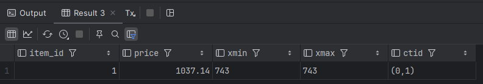
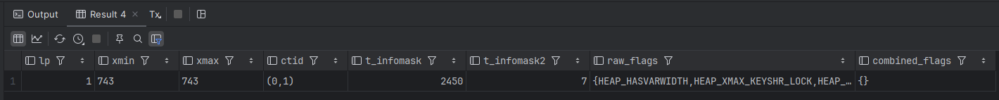
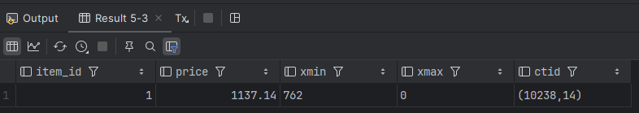
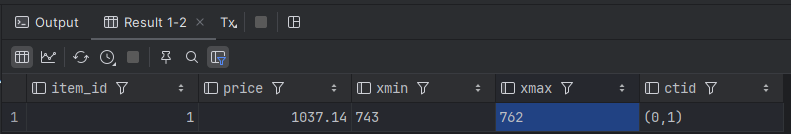
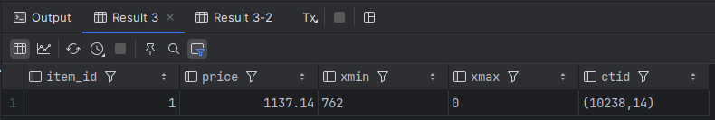
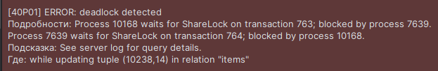
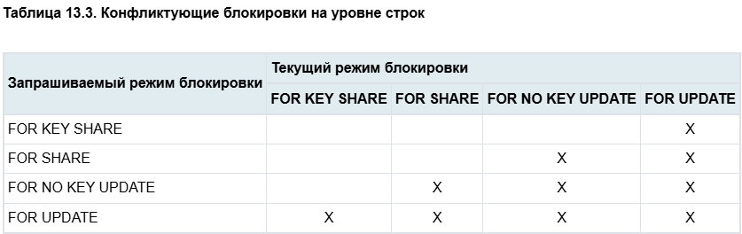

## 1. Смоделировать обновление данных и посмотреть на параметры xmin, xmax, ctid, t_infomask

### xmin, xmax, ctid

```sql
SELECT item_id, price, xmin, xmax, ctid
FROM marketplace.items
WHERE item_id = 1;
```



### метаданные
Для просмотра более подробных метаданных используется расширение pageinspect.

```sql
CREATE EXTENSION IF NOT EXISTS pageinspect;
```

В запросе мы берём page 0, разбиваем на кортежи
для каждой строки из h вызывает функцию расшифровки флагов с её текущими значениями t_infomask и t_infomask2
lp - line pointer
```sql
SELECT
    lp,
    t_xmin AS xmin,
    t_xmax AS xmax,
    t_ctid AS ctid,
    t_infomask,
    t_infomask2,
    raw_flags,
    combined_flags
FROM heap_page_items(get_raw_page('marketplace.items', 0)) h
         CROSS JOIN LATERAL heap_tuple_infomask_flags(h.t_infomask, h.t_infomask2) f
WHERE t_ctid = (SELECT ctid
    FROM marketplace.items
    WHERE item_id = 1);
```




## 2. Понять что хранится в t_infomask

t_infomask - битовый флаг, описывающий различные метаданные строки
Функция `heap_tuple_infomask_flags(h.t_infomask, h.t_infomask2)` расшифровывает эти флаги

## 3. Посмотреть на параметры из п1 в разных транзакциях
Транзакция A:
```sql
BEGIN;

UPDATE marketplace.items
SET price = price + 100
WHERE item_id = 1;

SELECT item_id, price, xmin, xmax, ctid
FROM marketplace.items
WHERE item_id = 1;
```




Транзакция B:
```sql
BEGIN;

SELECT item_id, price, xmin, xmax, ctid
FROM marketplace.items
WHERE item_id = 1;

SELECT
    lp,
    t_xmin AS xmin,
    t_xmax AS xmax,
    t_ctid AS ctid,
    t_infomask,
    t_infomask2,
    raw_flags,
    combined_flags
FROM heap_page_items(get_raw_page('marketplace.items', 0)) h
         CROSS JOIN LATERAL heap_tuple_infomask_flags(h.t_infomask, h.t_infomask2) f
ORDER BY lp;
```


Мы видим старое значение, тк транзакция A не закомичена

Сделаем коммит A и заново запустим B.



Цена поменялась

## Часть 4. Смоделировать дедлок, описать результаты

Транзакция A:
```sql
BEGIN;

UPDATE marketplace.items
SET price = price + 10
WHERE item_id = 1;
```
Транзакция B:
```sql
BEGIN;

UPDATE marketplace.items
SET price = price + 20
WHERE item_id = 2;
```

Транзакция A:
```sql
UPDATE marketplace.items
SET price = price + 10
WHERE item_id = 2;
```
postgres повис, ждет B

Транзакция B:
```sql
UPDATE marketplace.items
SET price = price + 20
WHERE item_id = 1;
```



## 5. Режимы блокировки на уровне строк
Проверим строку ситуаций for share с таблицы на сайте https://postgrespro.ru/docs/postgrespro/current/explicit-locking



Транзакция A:
```sql
BEGIN;
SELECT * FROM marketplace.items WHERE item_id = 1 FOR SHARE;
```

Транзакция B:
```sql
BEGIN;
SELECT * FROM marketplace.items WHERE item_id = 1 FOR KEY SHARE;      -- проходит
SELECT * FROM marketplace.items WHERE item_id = 1 FOR SHARE;          -- проходит
SELECT * FROM marketplace.items WHERE item_id = 1 FOR NO KEY UPDATE;  -- ждёт
SELECT * FROM marketplace.items WHERE item_id = 1 FOR UPDATE;         -- ждёт
```
Не соврали)

## 6. Очистка данных
`

Проверю обычную очистку с подробным выводом:
```sql
VACUUM (VERBOSE) marketplace.items;
```
```text
pvz.public> VACUUM (VERBOSE) marketplace.items
vacuuming "pvz.marketplace.items"
finished vacuuming "pvz.marketplace.items": index scans: 0
pages: 0 removed, 10239 remain, 2 scanned (0.02% of total)
tuples: 3 removed, 250000 remain, 0 are dead but not yet removable
removable cutoff: 765, which was 0 XIDs old when operation ended
index scan bypassed: 2 pages from table (0.02% of total) have 2 dead item identifiers
avg read rate: 0.861 MB/s, avg write rate: 1.291 MB/s
buffer usage: 25 hits, 2 misses, 3 dirtied
WAL usage: 3 records, 3 full page images, 16407 bytes
system usage: CPU: user: 0.01 s, system: 0.00 s, elapsed: 0.01 s
vacuuming "pvz.pg_toast.pg_toast_16483"
finished vacuuming "pvz.pg_toast.pg_toast_16483": index scans: 0
pages: 0 removed, 0 remain, 0 scanned (100.00% of total)
tuples: 0 removed, 0 remain, 0 are dead but not yet removable
removable cutoff: 765, which was 0 XIDs old when operation ended
new relfrozenxid: 765, which is 22 XIDs ahead of previous value
index scan not needed: 0 pages from table (100.00% of total) had 0 dead item identifiers removed
avg read rate: 1.749 MB/s, avg write rate: 0.000 MB/s
buffer usage: 27 hits, 1 misses, 0 dirtied
WAL usage: 1 records, 0 full page images, 188 bytes
system usage: CPU: user: 0.00 s, system: 0.00 s, elapsed: 0.00 s
```
