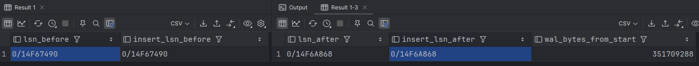
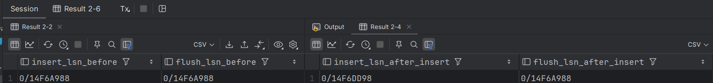
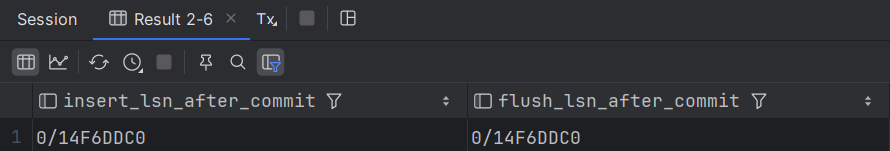
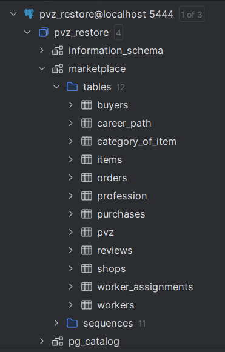
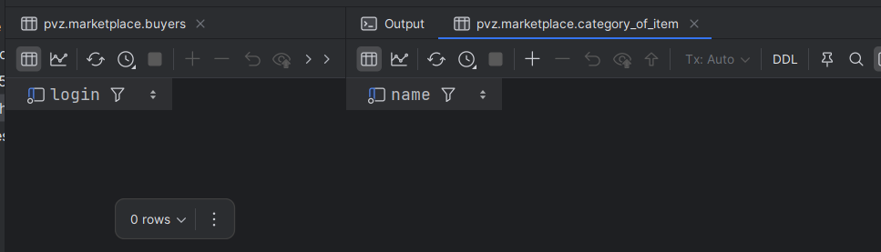
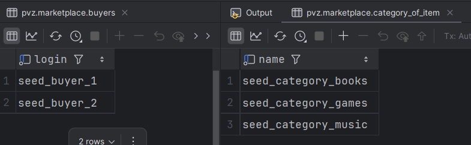
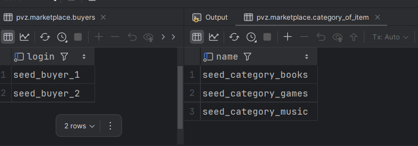

## 1. Посмотреть на изменение LSN и WAL после изменения данных
### a. Сравнение LSN до и после INSERT
```sql
SELECT pg_current_wal_lsn() AS lsn_before,
pg_current_wal_insert_lsn() AS insert_lsn_before;

INSERT INTO marketplace.category_of_item(name, description)
VALUES ('category_seed_lsn_1', 'Проверка LSN/WAL');

SELECT pg_current_wal_lsn() AS lsn_after,
pg_current_wal_insert_lsn() AS insert_lsn_after,
pg_wal_lsn_diff(pg_current_wal_lsn(), '0/0') AS wal_bytes_from_start;
```

тот что без insert - записанное на диск, а с - еще может быть в памяти, но не быть на диске


### b. Сравнение WAL до и после commit
```sql
BEGIN;

SELECT pg_current_wal_insert_lsn() AS insert_lsn_before,
       pg_current_wal_flush_lsn()  AS flush_lsn_before;

INSERT INTO marketplace.category_of_item(name, description)
VALUES ('category_seed_lsn_2', 'Проверка commit');

SELECT pg_current_wal_insert_lsn() AS insert_lsn_after_insert,
       pg_current_wal_flush_lsn()  AS flush_lsn_after_insert;
```

```sql
COMMIT;

SELECT pg_current_wal_insert_lsn() AS insert_lsn_after_commit,
       pg_current_wal_flush_lsn()  AS flush_lsn_after_commit;
```

### c. Анализ WAL размера после массовой операции
```sql
SELECT pg_current_wal_lsn() AS lsn_before \gset

INSERT INTO marketplace.category_of_item(name, description)
SELECT 'bulk_category_' || g, 'bulk wal test'
FROM generate_series(1, 10000) g
ON CONFLICT DO NOTHING;

SELECT pg_current_wal_lsn() AS lsn_after,
       pg_wal_lsn_diff(pg_current_wal_lsn(), :'lsn_before') AS wal_bytes_generated;
```
\gset - это спецкоманда постгреса, которая кладет результат в psql‑переменную, без нее через cte делать надо было бы, не очень смотрится)


## 2. Сделать дамп БД и накатить его на новую чистую БД
### a. Dump только структуры базы
```sql
pg_dump -h localhost -p 5444 -U admin -d pvz --schema-only -f hw5_pvz_schema.sql
```

### b. Dump одной таблицы
```bash
pg_dump -h localhost -p 5444 -U admin -d pvz -t marketplace.items -f hw5_items_dump.sql
```
Восстановление
```bash
createdb -h localhost -p 5444 -U admin pvz_restore
psql -h localhost -p 5444 -U admin -d pvz_restore -f hw5_pvz_schema.sql
psql -h localhost -p 5444 -U admin -d pvz_restore -f hw5_items_dump.sql
```


## 3. Создать несколько seed
### a. добавление тестовых данных
```sql
-- seed_01_categories.sql
INSERT INTO marketplace.category_of_item(name, description)
VALUES
  ('seed_category_books', 'Тестовая категория книг'),
  ('seed_category_games', 'Тестовая категория игр'),
  ('seed_category_music', 'Тестовая категория музыки')
ON CONFLICT (name) DO NOTHING;

-- seed_02_buyers.sql
INSERT INTO marketplace.buyers(login, password_hash, salt, email)
VALUES
    ('seed_buyer_1', md5('pw1'), md5('salt1'), 'seed1@example.com'),
    ('seed_buyer_2', md5('pw2'), md5('salt2'), 'seed2@example.com')
    ON CONFLICT (login) DO NOTHING;

```

### b. проверка идемпотентности seed (ON CONFLICT и др)
```sql
SELECT name
FROM marketplace.category_of_item
WHERE name LIKE 'seed_category_%'
ORDER BY name;

SELECT login
FROM marketplace.buyers
WHERE login LIKE 'seed_buyer_%'
ORDER BY login;
```
До запуска сидов:

После первого запуска сидов:

После второго запуска сидов:



