# Настроить потоковую репликацию

## Развернуть 3 PostgreSQL instance

Для physical replication проще всего поднять:
- `pg-master`
- `pg-replica1`
- `pg-replica2`

Ниже пример отдельного `docker-compose` 

```yaml
version: '3.9'

services:
  pg-master:
    image: postgres:15
    container_name: pg-master
    environment:
      POSTGRES_DB: pvz
      POSTGRES_USER: admin
      POSTGRES_PASSWORD: admin_pass
    ports:
      - "5444:5432"
    command: >
      postgres
      -c wal_level=replica
      -c max_wal_senders=10
      -c max_replication_slots=10
      -c hot_standby=on
    volumes:
      - pg_master_data:/var/lib/postgresql/data
      - ./init/master:/docker-entrypoint-initdb.d

  pg-replica1:
    image: postgres:15
    container_name: pg-replica1
    environment:
      PGPASSWORD: repl_pass
    ports:
      - "5445:5432"
    depends_on:
      - pg-master
    command: ["sleep", "infinity"]
    volumes:
      - pg_replica1_data:/var/lib/postgresql/data

  pg-replica2:
    image: postgres:15
    container_name: pg-replica2
    environment:
      PGPASSWORD: repl_pass
    ports:
      - "5446:5432"
    depends_on:
      - pg-master
    command: ["sleep", "infinity"]
    volumes:
      - pg_replica2_data:/var/lib/postgresql/data

volumes:
  pg_master_data:
  pg_replica1_data:
  pg_replica2_data:
```

- `wal_level=replica` — WAL содержит достаточно информации для physical replication.
- `max_wal_senders` — сколько процессов WAL sender можно открыть.
- `max_replication_slots` — пригодится для слотов репликации.
- `hot_standby=on` — реплики можно читать в режиме read-only.

Поднимаем контейнеры:

```bash
docker compose up -d
```

Проверяем:

```bash
docker ps
```

---

## Настроить physical streaming replication

### 1. Создать пользователя для репликации на master

```bash
docker exec -it pg-master psql -U admin -d pvz
```

```sql
CREATE ROLE replicator WITH REPLICATION LOGIN PASSWORD 'repl_pass';
```

### 2. Разрешить подключение реплик

На мастере нужно добавить запись в `pg_hba.conf`.

```bash
docker exec -it pg-master bash
```

```bash
echo "host replication replicator all scram-sha-256" >> "$PGDATA/pg_hba.conf"
echo "host all all all scram-sha-256" >> "$PGDATA/pg_hba.conf"
psql -U admin -d postgres -c "SELECT pg_reload_conf();"
```

### 3. Создать replication slot'ы

Слоты защищают от удаления WAL, который реплика ещё не успела прочитать.

```sql
SELECT * FROM pg_create_physical_replication_slot('replica1_slot');
SELECT * FROM pg_create_physical_replication_slot('replica2_slot');
```

### 4. Снять base backup для replica1

```bash
docker exec -it pg-replica1 bash
```

```bash
rm -rf /var/lib/postgresql/data/*
pg_basebackup \
  -h pg-master \
  -p 5432 \
  -U replicator \
  -D /var/lib/postgresql/data \
  -Fp -Xs -P -R \
  -S replica1_slot
```

### 5. Снять base backup для replica2

```bash
docker exec -it pg-replica2 bash
```

```bash
rm -rf /var/lib/postgresql/data/*
pg_basebackup \
  -h pg-master \
  -p 5432 \
  -U replicator \
  -D /var/lib/postgresql/data \
  -Fp -Xs -P -R \
  -S replica2_slot
```

### 6. Запустить реплики как PostgreSQL standby

После `pg_basebackup -R` внутри data directory будет создан `standby.signal` и настроен `primary_conninfo`.

Запускаем реплики:

```bash
docker restart pg-replica1
docker restart pg-replica2
```

Если контейнеры были созданы с `sleep infinity`, можно заменить команду на postgres или просто выполнить:

```bash
docker exec -d pg-replica1 postgres

docker exec -d pg-replica2 postgres
```

### 7. Проверить, что репликация работает

На мастере:


```sql
SELECT application_name,
       client_addr,
       state,
       sync_state,
       write_lag,
       flush_lag,
       replay_lag
FROM pg_stat_replication;
```

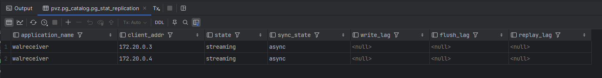

 `state = streaming` означает, что потоковая репликация активна.

---

# Проверка репликации данных

## Вставить данные на master


```sql
INSERT INTO marketplace.profession(name, salary)
VALUES ('replication_test_profession', 123456);
```

Проверка на мастере:

```sql
SELECT *
FROM marketplace.profession
WHERE name = 'replication_test_profession';
```

## Проверить наличие строки на репликах

На `pg-replica1`:

```sql
SELECT *
FROM marketplace.profession
WHERE name = 'replication_test_profession';
```

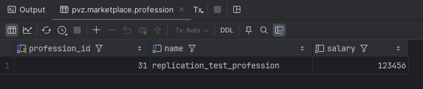

На `pg-replica2`:

```sql
SELECT *
FROM marketplace.profession
WHERE name = 'replication_test_profession';
```

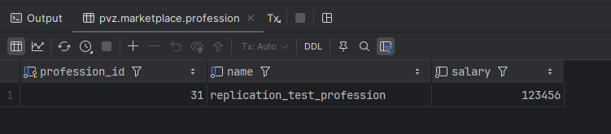

## Что произойдет если попробовать вставить данные на реплике

На любой реплике:

```sql
INSERT INTO marketplace.profession(name, salary)
VALUES ('should_fail_on_replica', 1);
```

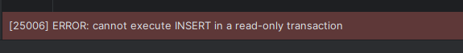

---

# Анализ replication lag

## создать нагрузку INSERT

Чтобы увидеть lag, нужно создать поток записей на мастере. Удобнее сделать отдельную тестовую таблицу.

На мастере:

```sql
CREATE TABLE IF NOT EXISTS marketplace.replication_lag_test (
    id BIGSERIAL PRIMARY KEY,
    payload TEXT,
    created_at TIMESTAMP DEFAULT now()
);
```

Теперь генерируем нагрузку:

```sql
INSERT INTO marketplace.replication_lag_test(payload)
SELECT md5(random()::text)
FROM generate_series(1, 100000);
```


## наблюдать lag

На мастере:

```sql
SELECT application_name,
       state,
       sent_lsn,
       write_lsn,
       flush_lsn,
       replay_lsn,
       write_lag,
       flush_lag,
       replay_lag
FROM pg_stat_replication;
```

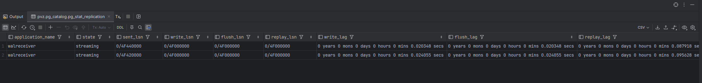

Дополнительно можно смотреть размер отставания в байтах:

```sql
SELECT application_name,
       pg_wal_lsn_diff(sent_lsn, replay_lsn) AS byte_lag
FROM pg_stat_replication;
```

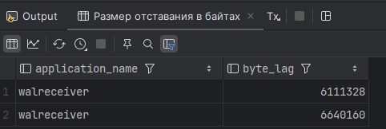

На реплике можно посмотреть, дошла ли она до последнего WAL:

```sql
SELECT pg_last_wal_receive_lsn(),
       pg_last_wal_replay_lsn(),
       now() - pg_last_xact_replay_timestamp() AS replay_delay;
```

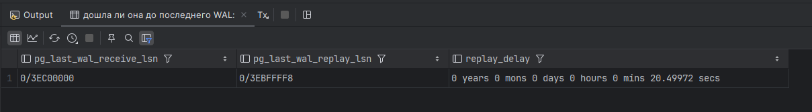

---

# Настроить Logical replication (изучить как делать – PUBLICATION/SUBSCRIPTION)

```yml
version: '3.9'

services:
  publisher:
    image: postgres:15
    container_name: pg_publisher
    environment:
      POSTGRES_DB: pvz
      POSTGRES_USER: admin
      POSTGRES_PASSWORD: admin_pass
    ports:
      - "5447:5432"
    command: >
      postgres
      -c wal_level=logical
      -c max_wal_senders=10
      -c max_replication_slots=10
      -c listen_addresses='*'
    volumes:
      - publisher_data:/var/lib/postgresql/data
      - ./init/master:/docker-entrypoint-initdb.d
    healthcheck:
      test: [ "CMD-SHELL", "pg_isready -U admin -d pvz" ]
      interval: 5s
      timeout: 5s
      retries: 10
      start_period: 10s

  subscriber:
    image: postgres:15
    container_name: pg_subscriber
    environment:
      POSTGRES_DB: pvz
      POSTGRES_USER: admin
      POSTGRES_PASSWORD: admin_pass
    ports:
      - "5448:5432"
    command: >
      postgres
      -c listen_addresses='*'
    volumes:
      - subscriber_data:/var/lib/postgresql/data
      - ./init/subscriber:/docker-entrypoint-initdb.d
    healthcheck:
      test: [ "CMD-SHELL", "pg_isready -U admin -d pvz" ]
      interval: 5s
      timeout: 5s
      retries: 10
      start_period: 10s

volumes:
  publisher_data:
  subscriber_data:
```

Добавляем доступ в `pg_hba.conf`:

```bash
docker exec -it pg_publisher bash
```

```bash
echo "host replication logical_repl all scram-sha-256" >> "$PGDATA/pg_hba.conf"
echo "host all all all scram-sha-256" >> "$PGDATA/pg_hba.conf"
psql -U admin -d postgres -c "SELECT pg_reload_conf();"
```

## Создать publication

На publisher:

```sql
CREATE PUBLICATION pvz_publication FOR ALL TABLES;
```

## Создать subscription

На subscriber:

```sql
CREATE SUBSCRIPTION pvz_subscription
CONNECTION 'host=pg_publisher port=5432 dbname=pvz user=admin password=admin_pass'
PUBLICATION pvz_publication;
```

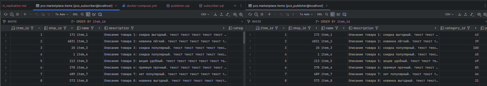

После создания subscription subscriber:

1. подключится к publisher,
2. создаст replication slot,
3. скопирует начальные данные,
4. начнёт получать последующие `INSERT/UPDATE/DELETE`.

---

## показать, что данные реплицируются

На publisher:

```sql
INSERT INTO marketplace.profession(name, salary)
VALUES ('logical_replication_test', 77777);
```

На subscriber:

```sql
SELECT *
FROM marketplace.profession
WHERE name = 'logical_replication_test';
```

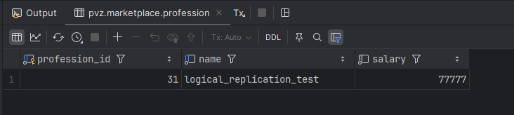

---

## показать, что DDL не реплицируется

На publisher:

```sql
ALTER TABLE marketplace.profession
ADD COLUMN description TEXT;
```

Проверка на subscriber:

```sql
SELECT * from marketplace.profession LIMIT 1;
```

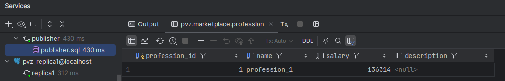

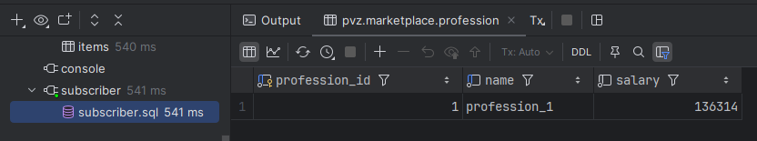

---

## Проверку REPLICA IDENTITY – Создать таблицу без PK и добавить в publication (что будет после UPDATE?)

Создаём таблицу без первичного ключа на publisher и subscriber:

```sql
CREATE TABLE marketplace.no_pk_table (
    value_text TEXT,
    updated_at TIMESTAMP DEFAULT now()
);
```

Добавляем её в публикацию (Не нужно, если на все таблицы публикация стоит):

```sql
ALTER PUBLICATION pvz_publication
ADD TABLE marketplace.no_pk_table;
```

Вставка проходит нормально:

```sql
INSERT INTO marketplace.no_pk_table(value_text)
VALUES ('before_update');
```

Теперь пробуем обновление:

```sql
UPDATE marketplace.no_pk_table
SET value_text = 'after_update'
WHERE value_text = 'before_update';
```

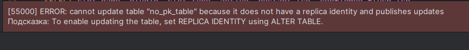

Для logical replication при `UPDATE` и `DELETE` издателю нужно уметь однозначно определить строку. Обычно для этого используется:

- `PRIMARY KEY`, или
- `REPLICA IDENTITY USING INDEX`, или
- `REPLICA IDENTITY FULL`.

Исправление:

```sql
ALTER TABLE marketplace.no_pk_table REPLICA IDENTITY FULL;
```

После этого `UPDATE` начнёт работать, но производительность может быть хуже, потому что в WAL будет передаваться больше данных.

Проверка:

```sql
UPDATE marketplace.no_pk_table
SET value_text = 'after_update'
WHERE value_text = 'before_update';
```

---

## Проверку replication status

На publisher:

```sql
SELECT pubname,
       schemaname,
       tablename
FROM pg_publication_tables
WHERE pubname = 'pvz_publication';
```

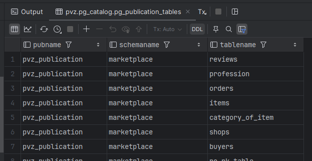

```sql
SELECT slot_name,
       plugin,
       slot_type,
       database,
       active
FROM pg_replication_slots;
```

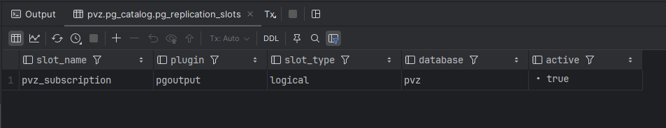

На subscriber:

```sql
SELECT subname,
       pid,
       relid::regclass,
       received_lsn,
       latest_end_lsn,
       latest_end_time
FROM pg_stat_subscription;
```

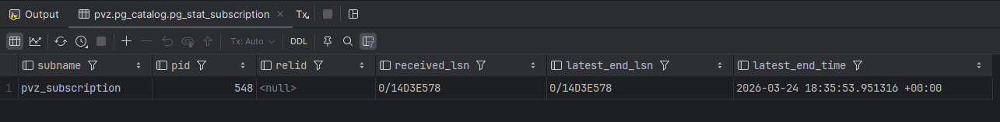

- `pg_publication_tables` — какие таблицы входят в publication.
- `pg_replication_slots` — есть ли slot для подписки.
- `pg_stat_subscription` — состояние subscription на subscriber.

Если `pid` не `NULL`, а `latest_end_time` обновляется, значит подписка живая и получает изменения.

---

## Как могут пригодится pg_dump/pg_restore для данного вида репликации

### Основная идея

Для logical replication `pg_dump/pg_restore` очень полезны, потому что lr:

- **не переносит DDL**,
- требует заранее созданной схемы на subscriber,
- часто используется между не полностью идентичными инстансами.

### Типовой сценарий

1. На publisher делаем экспорт схемы:

```bash
pg_dump -h pg-publisher -U admin -d pvz --schema-only > schema.sql
```

2. Восстанавливаем схему на subscriber:

```bash
psql -h pg-subscriber -U admin -d pvz < schema.sql
```

3. После этого включаем `PUBLICATION/SUBSCRIPTION` для догонки текущих изменений.
