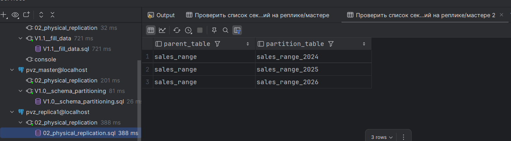
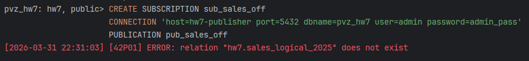
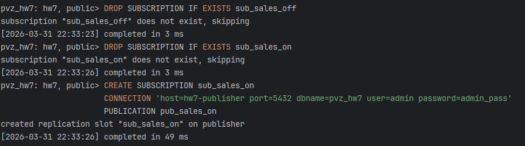
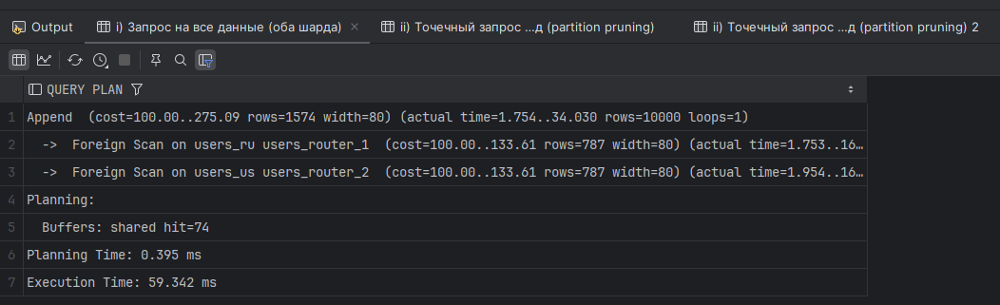
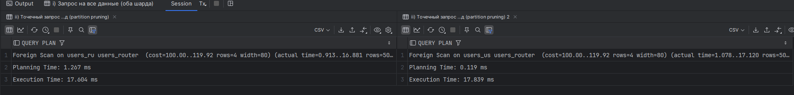

# HW7 — Секционирование и шардирование

Бд, поднимаемые в рамках домашки:
- `hw7-master` (порт `5551`) — секционирование (проверки для physical replication сделал на бд из hw6);
- `hw7-publisher` (порт `5552`) — logical replication publisher;
- `hw7-subscriber` (порт `5553`) — logical replication subscriber;
- `hw7-shard1` (порт `5554`) и `hw7-shard2` (порт `5555`) — шарды;
- `hw7-router` (порт `5556`) — router c `postgres_fdw`.

---

## 1) Секционирование: RANGE / LIST / HASH

Задание: для каждого типа дать ответы:
1. есть ли `partition pruning`
2. сколько партиций участвует в плане
3. используется ли индекс

### 1.1 RANGE

```sql
EXPLAIN (ANALYZE, BUFFERS)
SELECT *
FROM sales_range
WHERE sale_date BETWEEN DATE '2025-05-01' AND DATE '2025-05-31'
  AND customer_id = 1700;
```

```text
Index Scan using idx_sales_range_2025_customer on sales_range_2025 sales_range  (cost=0.15..8.17 rows=1 width=27) (actual time=0.014..0.014 rows=0 loops=1)
  Index Cond: (customer_id = 1700)
  Filter: ((sale_date >= '2025-05-01'::date) AND (sale_date <= '2025-05-31'::date))
  Buffers: shared hit=1
Planning Time: 0.125 ms
Execution Time: 0.026 ms

```

**Ответы:**
- `partition pruning`: **да** (фильтр по `sale_date` оставляет только партицию 2025 года);
- партиций в плане: **1**;
- индекс: **да**, используется `idx_sales_range_2025_customer` (или может быть выбран planner-ом при достаточной селективности).

### 1.2 LIST
```sql
EXPLAIN (ANALYZE, BUFFERS)
SELECT *
FROM orders_list
WHERE region = 'RU'
  AND created_at >= now() - interval '14 days';
```
```text
Bitmap Heap Scan on orders_list_ru orders_list  (cost=4.99..25.81 rows=91 width=25) (actual time=0.082..0.133 rows=85 loops=1)
  Recheck Cond: (created_at >= (now() - '14 days'::interval))
  Filter: (region = 'RU'::text)
  Heap Blocks: exact=19
  Buffers: shared hit=21
  ->  Bitmap Index Scan on idx_orders_list_ru_created_at  (cost=0.00..4.97 rows=91 width=0) (actual time=0.074..0.074 rows=85 loops=1)
        Index Cond: (created_at >= (now() - '14 days'::interval))
        Buffers: shared hit=2
Planning:
  Buffers: shared hit=49 dirtied=1
Planning Time: 0.346 ms
Execution Time: 0.153 ms


```
**Ответы:**
- `partition pruning`: **да** (по `region='RU'` читается только `orders_list_ru`);
- партиций в плане: **1**;
- индекс: **да**, `idx_orders_list_ru_created_at` релевантен фильтру по времени.

### 1.3 HASH
```sql
EXPLAIN (ANALYZE, BUFFERS)
SELECT *
FROM events_hash
WHERE account_id = 4242
  AND created_at >= now() - interval '10 days';
```

```text
Index Scan using events_hash_p0_pkey on events_hash_p0 events_hash  (cost=0.29..307.83 rows=10 width=71) (actual time=0.040..0.854 rows=8 loops=1)
  Index Cond: (account_id = 4242)
  Filter: (created_at >= (now() - '10 days'::interval))
  Buffers: shared hit=55
Planning Time: 0.158 ms
Execution Time: 0.879 ms
```

**Ответы:**
- `partition pruning`: **да**, при `account_id = const` выбирается одна hash-партиция;
- партиций в плане: **1**;
- индекс: **зависит от remainder**. В примере индекс создан только на `events_hash_p2`, поэтому будет использован только если `4242` попадает в эту партицию.

---

## 2) Секционирование и physical replication

Лень было снова поднимать реплицацию, проверил на репликации из hw6, подняв там на мастере таблицу из init скрипта мастера тут

### 2.a Проверить, что секционирование есть на репликах

```sql
-- на master (и затем тот же запрос на standby-реплике)
SELECT inhparent::regclass AS parent_table,
       inhrelid::regclass AS partition_table
FROM pg_inherits
WHERE inhparent = 'hw7.sales_range'::regclass;
```



**Ответ:** при physical replication дерево секций на standby совпадает с primary, потому что реплика получает WAL на уровне страниц/каталогов.

### 2.b Почему репликация «не знает» про секции?

**Ответ:** это формулировка про **logical replication**, не про physical.
- В **physical replication** секции «известны» (каталоги копируются).
- В **logical replication** передаются изменения строк и подписчик применяет их к своей схеме таблиц/секций.

---

## 3) Логическая репликация и `publish_via_partition_root = on / off`
[V1.0__partitioned_table.sql](init/publisher/V1.0__partitioned_table.sql)
[V1.1__publications.sql](init/publisher/V1.1__publications.sql)
[V1.0__partitioned_table.sql](init/subscriber/V1.0__partitioned_table.sql)
### Команды на publisher
```sql
CREATE PUBLICATION pub_sales_off FOR TABLE hw7.sales_logical
    WITH (publish_via_partition_root = false);

CREATE PUBLICATION pub_sales_on FOR TABLE hw7.sales_logical
    WITH (publish_via_partition_root = true);

INSERT INTO sales_logical (sale_date, customer_id, amount)
VALUES
    ('2025-04-01', 101, 1500.00),
    ('2026-07-10', 202, 2500.00);

SELECT pubname, pubviaroot
FROM pg_publication
WHERE pubname IN ('pub_sales_off', 'pub_sales_on');
```

### Команды на subscriber

```sql
-- Вариант A: подписка на pub_sales_off
DROP SUBSCRIPTION IF EXISTS sub_sales_off;
CREATE SUBSCRIPTION sub_sales_off
CONNECTION 'host=hw7-publisher port=5432 dbname=pvz_hw7 user=admin password=admin_pass'
PUBLICATION pub_sales_off;
       
-- Вариант B: подписка на pub_sales_on
DROP SUBSCRIPTION IF EXISTS sub_sales_on;
CREATE SUBSCRIPTION sub_sales_on
CONNECTION 'host=hw7-publisher port=5432 dbname=pvz_hw7 user=admin password=admin_pass'
PUBLICATION pub_sales_on;
```

**Ответ по `publish_via_partition_root`:**
- `false` — изменения публикуются от дочерних секций, схема у меня от паблишера, так что выдает ошибку

- `true` — изменения публикуются как от корневой таблицы (такой же root, так что все успешно).

---

## 4) Шардирование через `postgres_fdw`

### 4.a Самостоятельно реализовать: 2 шарда + router

[V1.0__fdw_setup.sql](init/router/V1.0__fdw_setup.sql)
[V1.0__customers_local.sql](init/shard1/V1.0__customers_local.sql)
[V1.0__customers_local.sql](init/shard2/V1.0__customers_local.sql)
### 4.b Сделать запросы и посмотреть план

Команды:

```sql
-- i) Запрос на все данные (оба шарда)
EXPLAIN (ANALYZE, BUFFERS)
SELECT * FROM users_router;

-- ii) Точечный запрос на RU-шард (partition pruning)
EXPLAIN (ANALYZE, BUFFERS)
SELECT *
FROM users_router
WHERE country = 'RU';

-- ii) Точечный запрос на US-шард (partition pruning)
EXPLAIN (ANALYZE, BUFFERS)
SELECT *
FROM users_router
WHERE country = 'US';
```

**Ответы:**
- для `SELECT * FROM users_router;` в плане участвуют оба шарда (`Foreign Scan` + `Append/UNION ALL`);

- для фильтра по значению страны план должен обращаться к целевому шарду.

