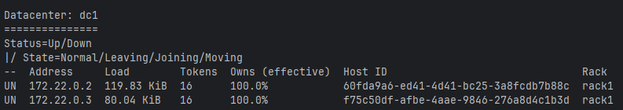
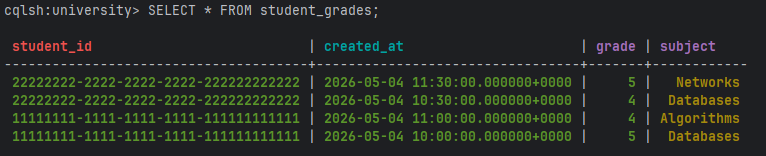
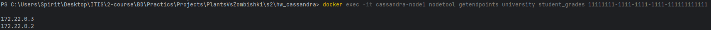
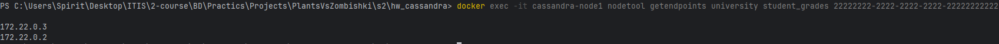
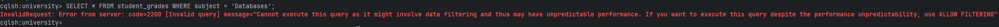
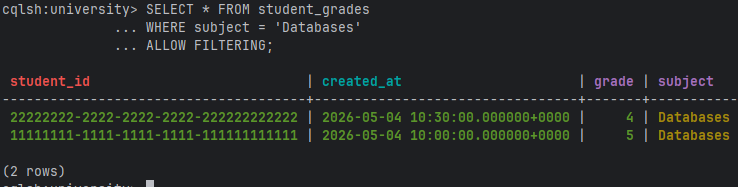

# Домашнее задание:

### Задание 1: Инициализация БД с репликацией

- Создайте файл docker-compose.yml с содержимым из readme.md, запустите его
- Создайте Keyspace `university` с фактором репликации **2** (чтобы данные дублировались на обе ноды).

#### Ответ

`docker-compose.yml`:

```yaml
services:
  node1:
    image: cassandra:latest
    container_name: cassandra-node1
    ports:
      - "9042:9042"
    volumes:
      - cassandra_node1_data:/var/lib/cassandra
    environment:
      - CASSANDRA_CLUSTER_NAME=TestCluster
      - CASSANDRA_ENDPOINT_SNITCH=GossipingPropertyFileSnitch
      - MAX_HEAP_SIZE=256M
      - HEAP_NEWSIZE=64M
    healthcheck:
      test: ["CMD-SHELL", "nodetool status | grep -E '^UN'"]
      interval: 15s
      timeout: 10s
      retries: 10

  node2:
    image: cassandra:latest
    container_name: cassandra-node2
    volumes:
      - cassandra_node2_data:/var/lib/cassandra
    environment:
      - CASSANDRA_CLUSTER_NAME=TestCluster
      - CASSANDRA_SEEDS=node1
      - CASSANDRA_ENDPOINT_SNITCH=GossipingPropertyFileSnitch
      - MAX_HEAP_SIZE=256M
      - HEAP_NEWSIZE=64M
    depends_on:
      node1:
        condition: service_healthy

volumes:
  cassandra_node1_data:
  cassandra_node2_data:
```

Команды запуска:

```bash
docker compose up -d
docker exec -it cassandra-node1 nodetool status
docker exec -it cassandra-node1 cqlsh
```



Создание keyspace:

```sql
CREATE KEYSPACE university
WITH replication = {
  'class': 'SimpleStrategy',
  'replication_factor': 2
};

USE university;
```

### Задание 2: Создание таблицы и данных

- Создайте таблицу `student_grades`: `student_id(uuid)`, `created_at`, `subject`, `grade`.
- Настройте ключи: **Partition Key** — `student_id`, **Clustering Key** — `created_at`.
- Выполните по 2 вставки  для двух разных студентов. Для генерации ID используйте функцию `uuid()`.

#### Ответ

```sql
USE university;

CREATE TABLE student_grades (
  student_id uuid,
  created_at timestamp,
  subject text,
  grade int,
  PRIMARY KEY (student_id, created_at)
) WITH CLUSTERING ORDER BY (created_at DESC);

-- Сгенерировать два UUID и сохранить их для вставок.
SELECT uuid() AS student_1 FROM system.local;
SELECT uuid() AS student_2 FROM system.local;
```

Пример вставок:

```sql
INSERT INTO student_grades (student_id, created_at, subject, grade)
VALUES (11111111-1111-1111-1111-111111111111, '2026-05-04 10:00:00', 'Databases', 5);

INSERT INTO student_grades (student_id, created_at, subject, grade)
VALUES (11111111-1111-1111-1111-111111111111, '2026-05-04 11:00:00', 'Algorithms', 4);

INSERT INTO student_grades (student_id, created_at, subject, grade)
VALUES (22222222-2222-2222-2222-222222222222, '2026-05-04 10:30:00', 'Databases', 4);

INSERT INTO student_grades (student_id, created_at, subject, grade)
VALUES (22222222-2222-2222-2222-222222222222, '2026-05-04 11:30:00', 'Networks', 5);

SELECT * FROM student_grades;
```



### Задание 3: Проверка распределения данных (Partitioning)

- Найдите UUID ваших студентов: `SELECT student_id FROM student_grades;`.
- В терминале выполните команду для получения ip нод с данными каждого UUID: `nodetool getendpoints keyspace table_name <UUID>`, посмотрите результат

#### Ответ

```sql
SELECT DISTINCT student_id FROM student_grades;
```

Проверка endpoint-нод для каждого `student_id`:

```bash
docker exec -it cassandra-node1 nodetool getendpoints university student_grades 11111111-1111-1111-1111-111111111111
docker exec -it cassandra-node1 nodetool getendpoints university student_grades 22222222-2222-2222-2222-222222222222
```





Так как у keyspace `replication_factor = 2`, в результате должны быть показаны две ноды/два IP-адреса, на которых лежат реплики partition.

### Задание 4: Работа с фильтрацией

- Попробуйте выполнить поиск по предмету (не ключевое поле), зафиксируйте ошибку 
- Выполните этот же запрос, добавив `ALLOW FILTERING`.  Посмотрите результаты.

#### Ответ

Запрос без `ALLOW FILTERING`:

```sql
SELECT * FROM student_grades WHERE subject = 'Databases';
```

Ожидаемая ошибка: Cassandra не разрешает фильтрацию по неключевому полю без явного `ALLOW FILTERING`, потому что такой запрос может потребовать сканирования всех partition.



Запрос с `ALLOW FILTERING`:

```sql
SELECT * FROM student_grades
WHERE subject = 'Databases'
ALLOW FILTERING;
```

Результат должен вернуть строки по предмету `Databases`. Для production-сценариев лучше создавать таблицу под конкретный запрос, например с `subject` в partition key, а не полагаться на `ALLOW FILTERING`.

