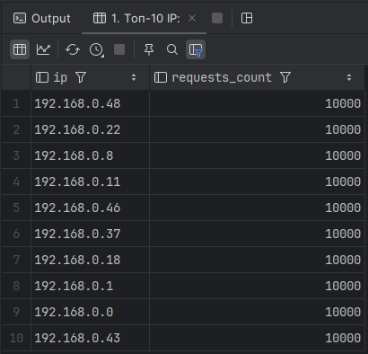
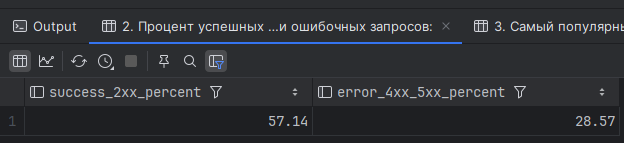
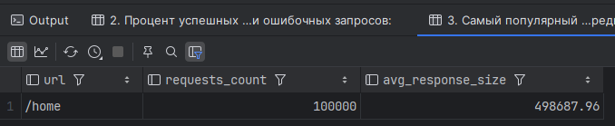
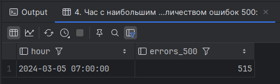
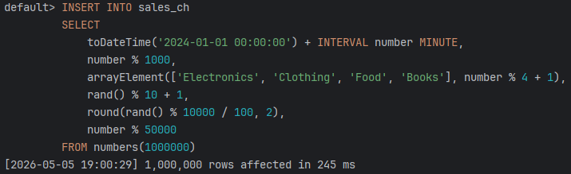
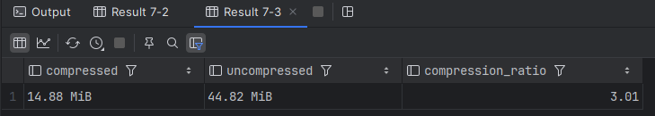
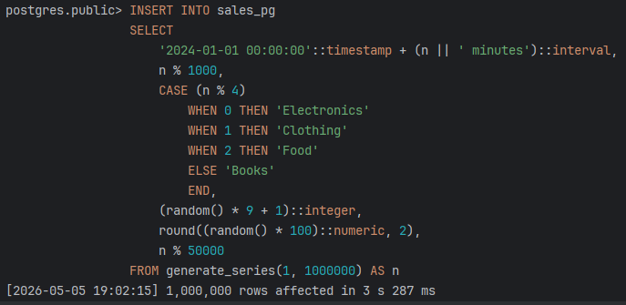
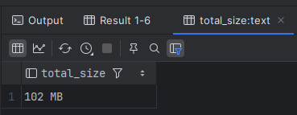
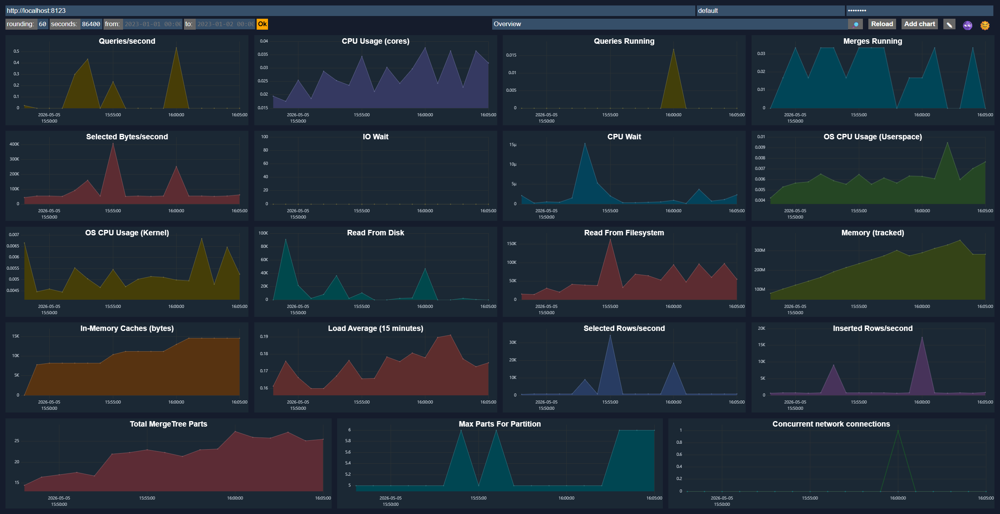

# Задание 1

## Готовая таблица + данные

```
	CREATE TABLE web_logs (
    log_time DateTime,
    ip String,
    url String,
    status_code UInt16,
    response_size UInt64
	) ENGINE = MergeTree()
	ORDER BY (log_time, status_code);
```

```
	INSERT INTO web_logs
	SELECT
    toDateTime('2024-03-01 00:00:00') + INTERVAL number SECOND,
    concat('192.168.0.', toString(number % 50)),
    arrayElement(['/home', '/api/users', '/api/orders', '/admin', '/products'], number % 5 + 1),
    arrayElement([200, 200, 200, 404, 500, 301, 200], number % 7 + 1),
    rand() % 1000000
	FROM numbers(500000);
```

## Таски

1. Найдите топ-10 IP-адресов по количеству запросов.
2. Посчитайте процент успешных запросов (2xx) и ошибочных (4xx, 5xx).
3. Найдите самый популярный URL и средний размер ответа для него.
4. Определите час с наибольшим количеством ошибок 500.

## Ответ

Запуск ClickHouse и PostgreSQL:

```bash
docker compose up -d
docker exec -it clickhouse-lab clickhouse-client --password password
```

Подготовка таблицы:

```sql
DROP TABLE IF EXISTS web_logs;

CREATE TABLE web_logs (
  log_time DateTime,
  ip String,
  url String,
  status_code UInt16,
  response_size UInt64
) ENGINE = MergeTree()
ORDER BY (log_time, status_code);

INSERT INTO web_logs
SELECT
  toDateTime('2024-03-01 00:00:00') + INTERVAL number SECOND,
  concat('192.168.0.', toString(number % 50)),
  arrayElement(['/home', '/api/users', '/api/orders', '/admin', '/products'], number % 5 + 1),
  arrayElement([200, 200, 200, 404, 500, 301, 200], number % 7 + 1),
  rand() % 1000000
FROM numbers(500000);
```

1. Топ-10 IP:

```sql
SELECT
  ip,
  count() AS requests_count
FROM web_logs
GROUP BY ip
ORDER BY requests_count DESC
LIMIT 10;
```

2. Процент успешных и ошибочных запросов:

```sql
SELECT
  round(countIf(status_code >= 200 AND status_code < 300) * 100.0 / count(), 2) AS success_2xx_percent,
  round(countIf(status_code >= 400 AND status_code < 600) * 100.0 / count(), 2) AS error_4xx_5xx_percent
FROM web_logs;
```

3. Самый популярный URL и средний размер ответа:

```sql
SELECT
  url,
  count() AS requests_count,
  round(avg(response_size), 2) AS avg_response_size
FROM web_logs
GROUP BY url
ORDER BY requests_count DESC
LIMIT 1;
```

4. Час с наибольшим количеством ошибок 500:

```sql
SELECT
  toStartOfHour(log_time) AS hour,
  count() AS errors_500
FROM web_logs
WHERE status_code = 500
GROUP BY hour
ORDER BY errors_500 DESC
LIMIT 1;
```

# Задание 2

## Сравнение с PostgreSQL

```
	CREATE TABLE sales_ch (
    sale_date DateTime,
    product_id UInt64,
    category String,
    quantity UInt32,
    price Float64,
    customer_id UInt64
	) ENGINE = MergeTree()
	ORDER BY (sale_date);

	INSERT INTO sales_ch
	SELECT
    toDateTime('2024-01-01 00:00:00') + INTERVAL number MINUTE,
    number % 1000,
    arrayElement(['Electronics', 'Clothing', 'Food', 'Books'], number % 4 + 1),
    rand() % 10 + 1,
    round(rand() % 10000 / 100, 2),
    number % 50000
	FROM numbers(1000000);
```

```
	CREATE TABLE sales_pg (
    sale_date timestamp,
    product_id bigint,
    category text,
    quantity integer,
    price float8,
    customer_id bigint
	);

	CREATE INDEX idx_sales_pg_date ON sales_pg(sale_date);
	CREATE INDEX idx_sales_pg_product ON sales_pg(product_id);

	INSERT INTO sales_pg
	SELECT
    '2024-01-01 00:00:00'::timestamp + (n || ' minutes')::interval,
    n % 1000,
    CASE (n % 4)
        WHEN 0 THEN 'Electronics'
        WHEN 1 THEN 'Clothing'
        WHEN 2 THEN 'Food'
        ELSE 'Books'
    END,
    (random() * 9 + 1)::integer,
    round((random() * 100)::numeric, 2),
    n % 50000
	FROM generate_series(1, 1000000) AS n;
```

## Выполните замеры и сделайте выводы

### Запросы

1. Продажи за последний месяц
2. Размер данных

## Ответьте на вопросы:

1. Какая СУБД быстрее вставила 1 млн строк?
2. Во сколько раз ClickHouse сжал данные эффективнее?
3. Какой вывод можно сделать о выборе СУБД для аналитики?
4. Разница ClickHouse и PostgreSQL

## Ответ

ClickHouse:

```bash
docker exec -it clickhouse-lab clickhouse-client --password password --time
```

```sql
DROP TABLE IF EXISTS sales_ch;

CREATE TABLE sales_ch (
  sale_date DateTime,
  product_id UInt64,
  category String,
  quantity UInt32,
  price Float64,
  customer_id UInt64
) ENGINE = MergeTree()
ORDER BY (sale_date);

INSERT INTO sales_ch
SELECT
  toDateTime('2024-01-01 00:00:00') + INTERVAL number MINUTE,
  number % 1000,
  arrayElement(['Electronics', 'Clothing', 'Food', 'Books'], number % 4 + 1),
  rand() % 10 + 1,
  round(rand() % 10000 / 100, 2),
  number % 50000
FROM numbers(1000000);

SELECT
  category,
  sum(quantity * price) AS revenue,
  count() AS sales_count
FROM sales_ch
WHERE sale_date >= (SELECT max(sale_date) - INTERVAL 1 MONTH FROM sales_ch)
GROUP BY category
ORDER BY revenue DESC;

SELECT
  formatReadableSize(sum(data_compressed_bytes)) AS compressed,
  formatReadableSize(sum(data_uncompressed_bytes)) AS uncompressed,
  round(sum(data_uncompressed_bytes) / sum(data_compressed_bytes), 2) AS compression_ratio
FROM system.parts
WHERE database = currentDatabase()
  AND table = 'sales_ch'
  AND active;
```

PostgreSQL:

```bash
docker exec -it postgres-lab psql -U postgres -d postgres
```

```sql
DROP TABLE IF EXISTS sales_pg;

CREATE TABLE sales_pg (
  sale_date timestamp,
  product_id bigint,
  category text,
  quantity integer,
  price float8,
  customer_id bigint
);

\timing on

INSERT INTO sales_pg
SELECT
  '2024-01-01 00:00:00'::timestamp + (n || ' minutes')::interval,
  n % 1000,
  CASE (n % 4)
    WHEN 0 THEN 'Electronics'
    WHEN 1 THEN 'Clothing'
    WHEN 2 THEN 'Food'
    ELSE 'Books'
  END,
  (random() * 9 + 1)::integer,
  round((random() * 100)::numeric, 2),
  n % 50000
FROM generate_series(1, 1000000) AS n;

CREATE INDEX idx_sales_pg_date ON sales_pg(sale_date);
CREATE INDEX idx_sales_pg_product ON sales_pg(product_id);

EXPLAIN ANALYZE
SELECT
  category,
  sum(quantity * price) AS revenue,
  count(*) AS sales_count
FROM sales_pg
WHERE sale_date >= (SELECT max(sale_date) - interval '1 month' FROM sales_pg)
GROUP BY category
ORDER BY revenue DESC;

SELECT pg_size_pretty(pg_total_relation_size('sales_pg')) AS total_size;
```

ClickHouse:



Postgres:


Выводы:

1. ClickHouse 
2. почти в 7 раз
3. Для аналитики, агрегаций и больших append-only таблиц ClickHouse подходит лучше. Для транзакционных сценариев, связей, ограничений и частых точечных обновлений лучше PostgreSQL.
4. ClickHouse — колоночная OLAP-СУБД, PostgreSQL — строковая OLTP/универсальная СУБД.

# Задние 3

Потыкаться в http://localhost:8123, посмотреть dashboard

## Ответ


