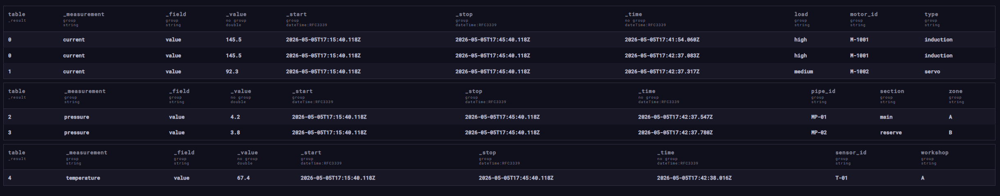
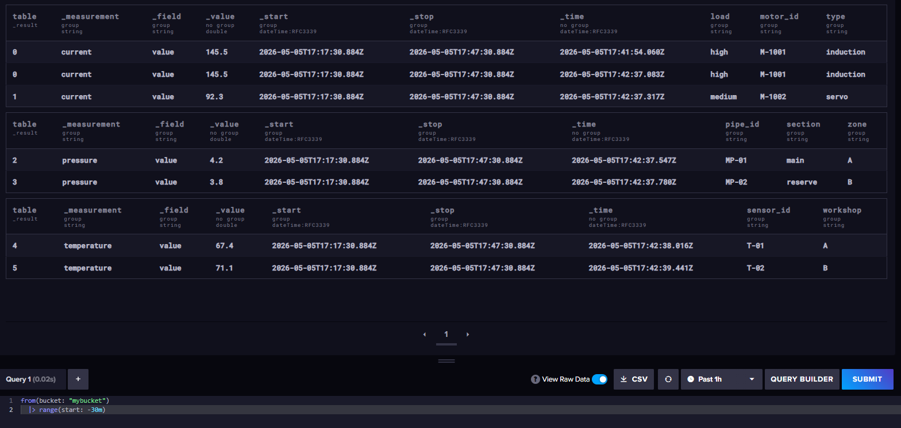
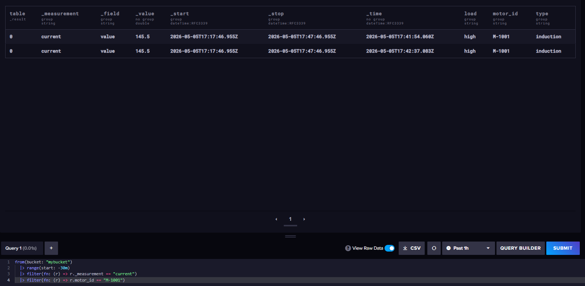
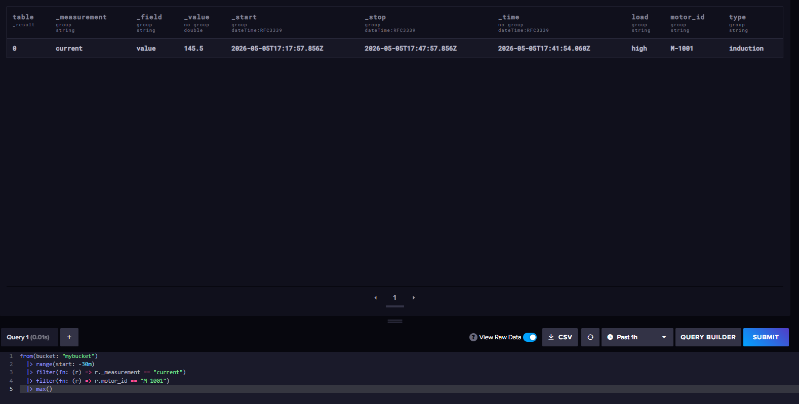
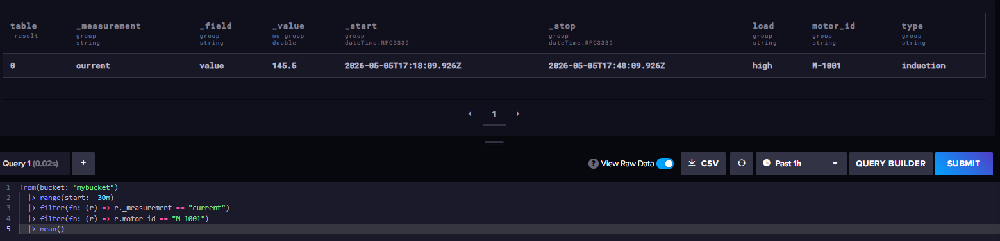
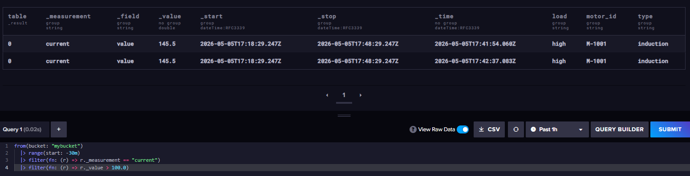
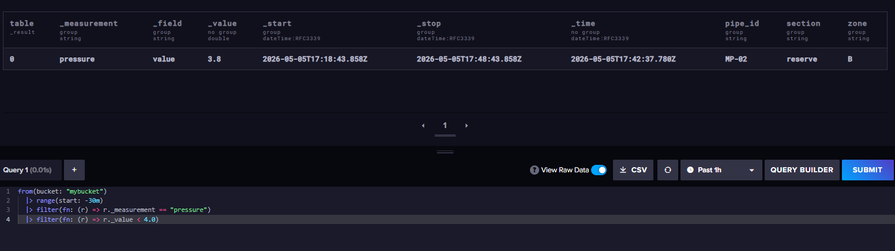
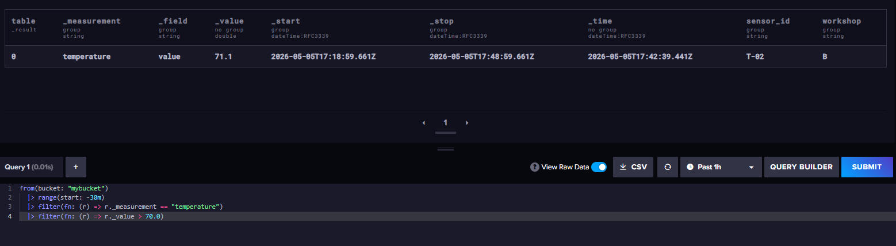
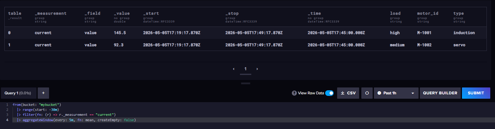
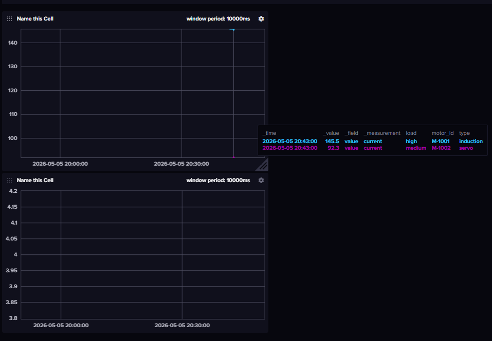

# InfluxDB — Домашнее задание

---

## Задание 1. Установка и запуск InfluxDB

## Ответ

`docker-compose.yml`:

```yaml
version: "3.9"

services:
  influxdb:
    image: influxdb:2.7
    container_name: influxdb
    ports:
      - "8086:8086"
    environment:
      - DOCKER_INFLUXDB_INIT_MODE=setup
      - DOCKER_INFLUXDB_INIT_USERNAME=admin
      - DOCKER_INFLUXDB_INIT_PASSWORD=admin123456
      - DOCKER_INFLUXDB_INIT_ORG=myorg
      - DOCKER_INFLUXDB_INIT_BUCKET=mybucket
      - DOCKER_INFLUXDB_INIT_ADMIN_TOKEN=my-token-123
    volumes:
      - influxdb-data:/var/lib/influxdb2

volumes:
  influxdb-data:
```

Запуск:

```bash
docker compose up -d
docker logs influxdb
```

Веб-интерфейс:

```text
http://localhost:8086
```

Логин: `admin`, пароль: `admin123456`, организация: `myorg`, bucket: `mybucket`.

## Задание 2. Создание базы через веб-интерфейс

## Ответ

В InfluxDB 2.x вместо базы используется bucket. В compose выше bucket `mybucket` создается автоматически. Через веб-интерфейс можно создать еще один:

```text
Load Data -> Buckets -> Create Bucket -> industrial_sensors
```

Через CLI:

```bash
docker exec -it influxdb influx bucket create ^
  --name industrial_sensors ^
  --org myorg ^
  --token my-token-123
```

## Задание 3. Наполнение данными (промышленных) датчиков

##Пример:

Потребляемый ток электродвигателями: current,motor_id=M-1001,type=induction,load=high value=145.5

Давление в трубопроводе: pressure,pipe_id=MP-01,section=main,zone=A value=4.2

## Ответ

Запись данных в line protocol:

```bash
docker exec -it influxdb influx write `
  --bucket mybucket `
  --org myorg `
  --token my-token-123 `
  "current,motor_id=M-1001,type=induction,load=high value=145.5"

docker exec -it influxdb influx write `
  --bucket mybucket `
  --org myorg `
  --token my-token-123 `
  "current,motor_id=M-1002,type=servo,load=medium value=92.3"

docker exec -it influxdb influx write `
  --bucket mybucket `
  --org myorg `
  --token my-token-123 `
  "pressure,pipe_id=MP-01,section=main,zone=A value=4.2"

docker exec -it influxdb influx write `
  --bucket mybucket `
  --org myorg `
  --token my-token-123 `
  "pressure,pipe_id=MP-02,section=reserve,zone=B value=3.8"

docker exec -it influxdb influx write `
  --bucket mybucket `
  --org myorg `
  --token my-token-123 `
  "temperature,sensor_id=T-01,workshop=A value=67.4"

docker exec -it influxdb influx write `
  --bucket mybucket `
  --org myorg `
  --token my-token-123 `
  "temperature,sensor_id=T-02,workshop=B value=71.1"
```


## Задание 4. Базовые запросы

- Просмотреть все данные за последние 30 минут

- Посмотреть измерения только 1 датчика

- Максимальное значение на 1 датчике

- Среднее значение на датчике

- 2-3 аналитических запроса с фильтром по значению

- Запрос на агрегацию данных

## Ответ

Все данные за последние 30 минут:

```flux
from(bucket: "mybucket")
  |> range(start: -30m)
```

Измерения только одного датчика:

```flux
from(bucket: "mybucket")
  |> range(start: -30m)
  |> filter(fn: (r) => r._measurement == "current")
  |> filter(fn: (r) => r.motor_id == "M-1001")
```

Максимальное значение на одном датчике:

```flux
from(bucket: "mybucket")
  |> range(start: -30m)
  |> filter(fn: (r) => r._measurement == "current")
  |> filter(fn: (r) => r.motor_id == "M-1001")
  |> max()
```

Среднее значение на датчике:

```flux
from(bucket: "mybucket")
  |> range(start: -30m)
  |> filter(fn: (r) => r._measurement == "current")
  |> filter(fn: (r) => r.motor_id == "M-1001")
  |> mean()
```

Аналитический запрос 1: перегруженные двигатели с током выше 100:

```flux
from(bucket: "mybucket")
  |> range(start: -30m)
  |> filter(fn: (r) => r._measurement == "current")
  |> filter(fn: (r) => r._value > 100.0)
```

Аналитический запрос 2: давление ниже 4:

```flux
from(bucket: "mybucket")
  |> range(start: -30m)
  |> filter(fn: (r) => r._measurement == "pressure")
  |> filter(fn: (r) => r._value < 4.0)
```

Аналитический запрос 3: температура выше 70:

```flux
from(bucket: "mybucket")
  |> range(start: -30m)
  |> filter(fn: (r) => r._measurement == "temperature")
  |> filter(fn: (r) => r._value > 70.0)
```

Агрегация данных по 5-минутным окнам:

```flux
from(bucket: "mybucket")
  |> range(start: -30m)
  |> filter(fn: (r) => r._measurement == "current")
  |> aggregateWindow(every: 5m, fn: mean, createEmpty: false)
```

Команда запуска Flux-запроса через CLI:

```bash
docker exec -it influxdb influx query ^
  --org myorg ^
  --token my-token-123 ^
  "from(bucket: \"mybucket\") |> range(start: -30m)"
```

## Задание 5. Создайте Dashboard с 1-2 графиками

## Ответ

Через веб-интерфейс:

```text
Boards -> Create Dashboard -> Add Cell
```

График 1, ток двигателей:

```flux
from(bucket: "mybucket")
  |> range(start: -1h)
  |> filter(fn: (r) => r._measurement == "current")
  |> aggregateWindow(every: 1m, fn: mean, createEmpty: false)
```

График 2, давление в трубопроводе:

```flux
from(bucket: "mybucket")
  |> range(start: -1h)
  |> filter(fn: (r) => r._measurement == "pressure")
  |> aggregateWindow(every: 1m, fn: mean, createEmpty: false)
```
