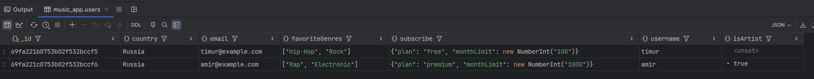
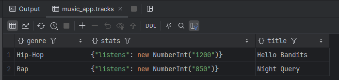
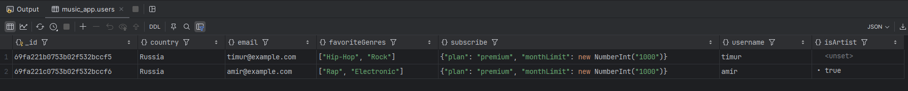
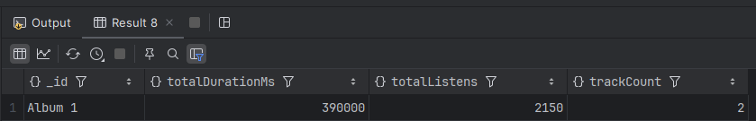

# Домашнее задание — MongoDB

## Задание

- Поднять в docker compose mongoDB
- Создать минимум 3 коллекции, хотя бы 2 из которых связаны `ObjectId`, хотя бы 1 из документов в коллекции хранят JSON объекты либо массивы
- Наполнить каждую коллекцию необходимым количеством данных
- Написать 2 `find` запроса, хотя бы 1 с projection (`{ field1: 0, field2: 1 }`)
- Написать 2 `update` запроса
- Написать 1 любой запрос с `aggregate`

## Ответ

`docker-compose.yml`:

```yaml
services:
  mongodb:
    image: mongo:7
    container_name: mongodb
    ports:
      - "27017:27017"
    environment:
      MONGO_INITDB_ROOT_USERNAME: root
      MONGO_INITDB_ROOT_PASSWORD: root
    volumes:
      - mongodb-data:/data/db

volumes:
  mongodb-data:
```

Запуск и вход в shell:

```bash
docker compose up -d
docker exec -it mongodb mongosh -u root -p root
```

Создание БД, коллекций и данных:

```javascript
use music_app;

const timurId = new ObjectId();
const amirId = new ObjectId();
const albumId = new ObjectId();

db.users.insertMany([
  {
    _id: timurId,
    username: "timur",
    email: "timur@example.com",
    country: "Russia",
    subscribe: {
      plan: "free",
      monthLimit: 100
    },
    favoriteGenres: ["Hip-Hop", "Rock"]
  },
  {
    _id: amirId,
    username: "amir",
    email: "amir@example.com",
    country: "Russia",
    subscribe: {
      plan: "premium",
      monthLimit: 1000
    },
    favoriteGenres: ["Rap", "Electronic"],
    isArtist: true
  }
]);

db.albums.insertOne({
  _id: albumId,
  title: "Album 1",
  artistId: amirId,
  year: 2026,
  tags: ["new", "studio"]
});

db.tracks.insertMany([
  {
    title: "Hello Bandits",
    description: "Hello Bandits is a good song",
    durationMs: 180000,
    artistId: amirId,
    albumId: albumId,
    genre: "Hip-Hop",
    stats: {
      listens: 1200,
      likes: 250
    },
    createdAt: new Date()
  },
  {
    title: "Night Query",
    description: "Track about databases",
    durationMs: 210000,
    artistId: amirId,
    albumId: albumId,
    genre: "Rap",
    stats: {
      listens: 850,
      likes: 140
    },
    createdAt: new Date()
  }
]);
```

Две коллекции связаны через `ObjectId`: `tracks.artistId -> users._id`, `tracks.albumId -> albums._id`, `albums.artistId -> users._id`. JSON-объекты и массивы есть в `subscribe`, `favoriteGenres`, `tags`, `stats`.

`find` запросы:

```javascript
db.users.find({ country: "Russia" });

db.tracks.find(
  { genre: { $in: ["Hip-Hop", "Rap"] } },
  { title: 1, genre: 1, "stats.listens": 1, _id: 0 }
);
```



`update` запросы:

```javascript
db.users.updateOne(
  { username: "timur" },
  { $set: { "subscribe.plan": "premium", "subscribe.monthLimit": 1000 } }
);

db.tracks.updateMany(
  { genre: "Hip-Hop" },
  {
    $inc: { "stats.listens": 100 },
    $currentDate: { updatedAt: true }
  }
);
```



`aggregate` запрос:

```javascript
db.tracks.aggregate([
  {
    $lookup: {
      from: "albums",
      localField: "albumId",
      foreignField: "_id",
      as: "album"
    }
  },
  { $unwind: "$album" },
  {
    $group: {
      _id: "$album.title",
      trackCount: { $sum: 1 },
      totalDurationMs: { $sum: "$durationMs" },
      totalListens: { $sum: "$stats.listens" }
    }
  },
  { $sort: { totalListens: -1 } }
]);
```
