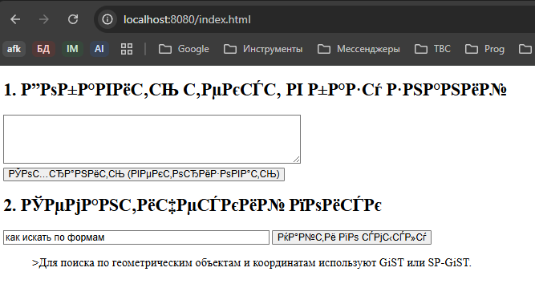
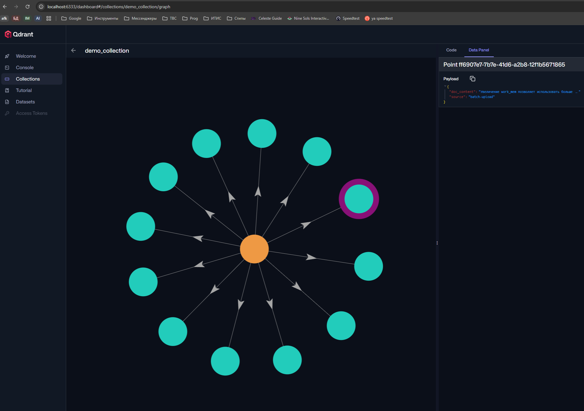

### Домашнее задание по Qdrant 

1) Склонировать репозиторий https://github.com/ZhenShenITIS/hw-qdrant
2) Запустить в консоли `docker compose up -d --build`
3) Подождать 5-10 минут (Будет происходить сборка проекта и скачивание модели)
4) Открыть http://localhost:8080/
5) В поле добавления ввести текст, разделенный `;`
   Пример: 
```text
Индексы B-Tree отлично подходят для поиска точных совпадений и сортировки данных.;VACUUM очищает таблицу от мертвых строк (dead tuples), предотвращая раздувание файлов.;Команда EXPLAIN ANALYZE позволяет увидеть реальный план выполнения запроса и затраченное время.;Использование пула соединений, такого как PgBouncer, снижает нагрузку на сервер при большом количестве клиентов.;Партицирование таблиц помогает ускорить удаление старых данных и улучшает производительность выборок.;Материализованные представления сохраняют результаты сложных агрегаций для быстрого чтения.;Увеличение параметра work_mem позволяет базе использовать больше оперативной памяти для сортировки и хеширования.;Write-Ahead Log (WAL) обеспечивает надежность данных и используется для репликации.;Для поиска по геометрическим объектам и координатам лучше всего использовать индекс GiST или SP-GiST.;Триггеры в базе данных позволяют автоматически выполнять функции при вставке или обновлении записей.;Тип данных JSONB хранит документы в бинарном формате, что ускоряет доступ к ключам.;Настройка shared_buffers критически важна, так как она определяет, сколько данных будет кэшироваться в памяти.
```
6) Попробовать семантический поиск. Примеры запросов:
   - как искать по формам
   - как улучшить очистку данных
   - как увеличить настройку ОЗУ
7) Перейти на http://localhost:6333/dashboard#/collections/demo_collection/graph и запустить пример кода справа с LIMIT 15 и посмотреть как выглядят данные

## Ответ

Команды:

```bash
git clone https://github.com/ZhenShenITIS/hw-qdrant
cd hw-qdrant
docker compose up -d --build
docker compose ps
```

После запуска открыть:

```text
http://localhost:8080/
```

Если нужен минимальный `docker-compose.yml` только для Qdrant:

```yaml
services:
  qdrant:
    image: qdrant/qdrant:latest
    container_name: qdrant
    ports:
      - "6333:6333"
      - "6334:6334"
    volumes:
      - qdrant_data:/qdrant/storage

volumes:
  qdrant_data:
```

Проверка Qdrant:

```bash
curl http://localhost:6333/collections
```

Текст для вставки в поле добавления:

```text
Индексы B-Tree отлично подходят для поиска точных совпадений и сортировки данных.;VACUUM очищает таблицу от мертвых строк (dead tuples), предотвращая раздувание файлов.;Команда EXPLAIN ANALYZE позволяет увидеть реальный план выполнения запроса и затраченное время.;Использование пула соединений, такого как PgBouncer, снижает нагрузку на сервер при большом количестве клиентов.;Партицирование таблиц помогает ускорить удаление старых данных и улучшает производительность выборок.;Материализованные представления сохраняют результаты сложных агрегаций для быстрого чтения.;Увеличение параметра work_mem позволяет базе использовать больше оперативной памяти для сортировки и хеширования.;Write-Ahead Log (WAL) обеспечивает надежность данных и используется для репликации.;Для поиска по геометрическим объектам и координатам лучше всего использовать индекс GiST или SP-GiST.;Триггеры в базе данных позволяют автоматически выполнять функции при вставке или обновлении записей.;Тип данных JSONB хранит документы в бинарном формате, что ускоряет доступ к ключам.;Настройка shared_buffers критически важна, так как она определяет, сколько данных будет кэшироваться в памяти.
```

Примеры запросов для семантического поиска:

```text
как искать по формам
как улучшить очистку данных
как увеличить настройку ОЗУ
как посмотреть план выполнения запроса
как ускорить агрегации
```



Dashboard коллекции:

```text
http://localhost:6333/dashboard#/collections/demo_collection/graph
```

В правом примере кода можно поставить:

```text
LIMIT 15
```



смысл результата: Qdrant хранит векторы документов из добавленного текста и показывает ближайшие по смыслу записи, а не только точные совпадения слов.
