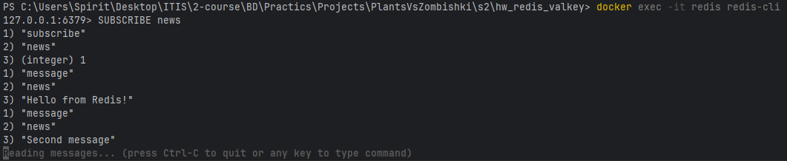

# Redis / Valkey — Домашнее задание

---

## Задание 1. Hash — данные о студентах

Создайте 3 студентов, используя Hash. Каждый ключ — `student:<id>`, поля: `name`, `group`, `gpa`.
Проверьте, что данные записались
---

## Ответ

`docker-compose.yml`:

```yaml
services:
  redis:
    image: redis:7
    container_name: redis
    ports:
      - "6379:6379"
    volumes:
      - redis-data:/data
    command: redis-server --appendonly yes

volumes:
  redis-data:
```

Запуск:

```bash
docker compose up -d
docker exec -it redis redis-cli
```

Команды Redis:

```redis
HSET student:1 name "Маслоу" group "11-400" gpa 4.7
HSET student:2 name "Женьшень" group "11-400" gpa 4.1
HSET student:3 name "Абсолут" group "11-400" gpa 4.3
HSET student:4 name "Арбуз" group "11-400" gpa 4.5
HSET student:5 name "Айсиписяев" group "11-400" gpa 4.9

HGETALL student:1
HGETALL student:2
HGETALL student:3
HGETALL student:4
HGETALL student:5
```

## Задание 2. Sorted Set — лидерборд по GPA

Создайте рейтинг студентов по среднему баллу. В Sorted Set score = GPA, member = имя.
Выведите топ-3 по убыванию GPA:

---

## Ответ

```redis
ZADD students:gpa 4.7 "Маслоу" 4.1 "Женьшень" 4.3 "Абсолут" 4.5 "Арбуз" 4.9 "Айсиписяев"
ZREVRANGE students:gpa 0 2 WITHSCORES
```

## Задание 3. List — очередь задач

Добавьте 5 задач в очередь через `RPUSH`:
Заберите 3 задачи из очереди (FIFO — первый вошёл, первый вышел):

---

## Ответ

```redis
RPUSH tasks "send_email" "generate_report" "backup_db" "clear_cache" "sync_users"
LRANGE tasks 0 -1

LPOP tasks
LPOP tasks
LPOP tasks

LRANGE tasks 0 -1
```

## Задание 4. TTL — время жизни ключа

Создайте ключ с TTL 10 секунд:
Сразу проверьте оставшееся время:
Подождите и попробуйте получить значение:

## Ответ

```redis
SET temp:code "123456" EX 10
TTL temp:code
GET temp:code
```

Через 10 секунд:

```redis
GET temp:code
TTL temp:code
```

результат после истечения TTL: `GET` вернул `<null>`, `TTL` вернул `-2`.

## Задание 5. Транзакция MULTI/EXEC

Смоделируйте «перевод» 1 балла GPA от студента 1 к студенту 2.

## Ответ

Для числовых операций удобно хранить GPA как число в отдельных ключах:

```redis
HSET student:1 gpa 4.7
HSET student:2 gpa 4.9

MULTI
HINCRBYFLOAT student:1 gpa -1
HINCRBYFLOAT student:2 gpa 1
EXEC

HGET student:1 gpa
HGET student:2 gpa
```

## Задание 6 (бонус). Pub/Sub

Откройте **два** терминала с `redis-cli`.

**Терминал 1** — подписчик:

```bash
docker exec -it redis redis-cli
```

```
SUBSCRIBE news
```

**Терминал 2** — издатель:

```bash
docker exec -it redis redis-cli
```

```
PUBLISH news "Hello from Redis!"
PUBLISH news "Second message"
```

## Ответ

В первом терминале:

```redis
SUBSCRIBE news
```

Во втором терминале:

```redis
PUBLISH news "Hello from Redis!"
PUBLISH news "Second message"
```

результат: подписчик в первом терминале сразу получает оба сообщения из канала `news`.


