## Подзапросы для схемы marketplace

# 1. Подзапрос в SELECT

## 1.1 Средняя цена товаров магазина для каждого товара

```sql
SELECT   i.item_id,   i.name,   i.price,   (SELECT AVG(i2.price)    
	FROM marketplace.items i2    
	WHERE i2.shop_id = i.shop_id) AS avg_shop_price 
FROM marketplace.items i 
ORDER BY i.shop_id, i.item_id;
```


## 1.2 Количество покупок для каждого покупателя

```sql
SELECT   b.buyer_id,   b.login,   (SELECT COUNT(*)    
	FROM marketplace.purchases p    
	WHERE p.buyer_id = b.buyer_id) AS total_purchases 
FROM marketplace.buyers b 
ORDER BY total_purchases DESC;
```


## 1.3 Средний рейтинг товара на основе отзывов

```sql
SELECT   i.item_id,   i.name,   i.price,   (SELECT AVG(r.rating)    
	FROM marketplace.reviews r    
	JOIN marketplace.purchases p 
	ON p.purchase_id = r.purchase_id    
	WHERE p.item_id = i.item_id) AS avg_rating 
FROM marketplace.items i 
ORDER BY avg_rating DESC;
```


# 2. Подзапрос в FROM

## 2.1 Статистика магазинов(всего товаров и средняя цена)


```sql
SELECT   shop_stats.shop_id,   shop_stats.shop_name,   shop_stats.total_items,   shop_stats.avg_price 
FROM (SELECT     s.shop_id,     s.name AS shop_name,     COUNT(i.item_id)
	AS total_items,     AVG(i.price) AS avg_price  
	FROM marketplace.shops s   
	LEFT JOIN marketplace.items i 
	ON i.shop_id = s.shop_id   
	GROUP BY s.shop_id, s.name ) AS shop_stats 
ORDER BY shop_stats.avg_price DESC;
```
​

## 2.2 Количество покупок по покупателям

```sql
SELECT s.buyer_id, s.purchase_count
FROM (
  SELECT p.buyer_id, COUNT(*) AS purchase_count
  FROM marketplace.purchases p
  GROUP BY p.buyer_id
) AS s
ORDER BY s.purchase_count DESC;

```
​​

## 2.3 Доход по категориям

```sql
SELECT x.category_id, x.total_revenue
FROM (
  SELECT i.category_id, SUM(i.price) AS total_revenue
  FROM marketplace.items i
  JOIN marketplace.purchases p ON p.item_id = i.item_id
  WHERE p.status = 'completed'
  GROUP BY i.category_id
) AS x
ORDER BY x.total_revenue DESC;

```
​


# 3. Подзапрос в WHERE

## 3.1 Товары с ценой выше средней по категории

```sql
SELECT   i.item_id,   i.name,   i.price,   i.category_id 
FROM marketplace.items i 
WHERE i.price > (SELECT AVG(i2.price)   
	FROM marketplace.items i2   
	WHERE i2.category_id = i.category_id) 
ORDER BY i.category_id, i.price DESC;
```
​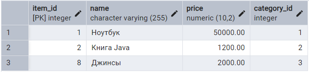

## 3.2 Покупатели, совершившие покупки в определённых магазинах

```sql
SELECT   b.buyer_id,   b.login 
FROM marketplace.buyers b 
WHERE b.buyer_id IN (SELECT DISTINCT p.buyer_id   
	FROM marketplace.purchases p   
	JOIN marketplace.items i 
	ON i.item_id = p.item_id   
	WHERE i.shop_id IN (SELECT s.shop_id FROM marketplace.shops s WHERE s.name LIKE 'Магазин электроники')) ORDER BY b.buyer_id;
```
​​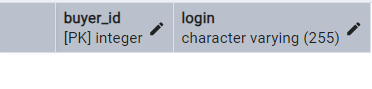

## 3.3 Покупатели, у которых вообще есть покупки

```sql
SELECT b.buyer_id, b.login
FROM marketplace.buyers b
WHERE EXISTS (
  SELECT *
  FROM marketplace.purchases p
  WHERE p.buyer_id = b.buyer_id
);
```
​​

# 4. Подзапрос в HAVING

## 4.1 Магазины с суммой завершённых покупок выше 1000

```sql
SELECT i.shop_id, SUM(i.price) AS total_revenue
FROM marketplace.items i
JOIN marketplace.purchases p ON p.item_id = i.item_id
WHERE p.status = 'completed'
GROUP BY i.shop_id
HAVING SUM(i.price) > 1000;

```
​

## 4.2 Категории, где количество покупок больше средней по всем покупкам

```sql
SELECT i.category_id, COUNT(*) AS purchases_count
FROM marketplace.purchases p
JOIN marketplace.items i ON i.item_id = p.item_id
GROUP BY i.category_id
HAVING COUNT(*) >= (
  SELECT AVG(cnt) FROM (
    SELECT COUNT(*) AS cnt
    FROM marketplace.purchases
    GROUP BY category_id
  ) AS t
);

```
​

## 4.3 ПВЗ с числом доставленных заказов больше среднего числа доставок

```sql
SELECT o.pvz_id, COUNT(*) AS delivered_count
FROM marketplace.orders o
WHERE o.status = 'delivered'
GROUP BY o.pvz_id
HAVING COUNT(*) > (
  SELECT AVG(cnt)
  FROM (
    SELECT COUNT(*) AS cnt
    FROM marketplace.orders
    WHERE status = 'delivered'
    GROUP BY pvz_id
  ) AS x
);


```
​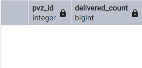

# 5. Подзапросы с ALL

## 5.1 Товары с ценой выше всех других товаров в своей категории

```sql
SELECT
  i.item_id,
  i.name,
  i.price
FROM marketplace.items i
WHERE i.price > ALL (
  SELECT price
  FROM marketplace.items i2
  WHERE i2.category_id = i.category_id
    AND i2.item_id <> i.item_id
)
ORDER BY i.category_id, i.price DESC;
```
​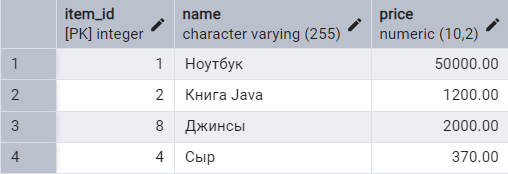

## 5.2 Работники с наивысшей зарплатой

```sql
SELECT w.worker_id, p.name, p.salary
FROM marketplace.workers w
JOIN marketplace.worker_assignments wa ON w.worker_id = wa.worker_id
JOIN marketplace.profession p ON wa.work_id = p.profession_id
WHERE p.salary >= ALL (
  SELECT p2.salary 
  FROM marketplace.worker_assignments wa2
  JOIN marketplace.profession p2 ON wa2.work_id = p2.profession_id
);

```
​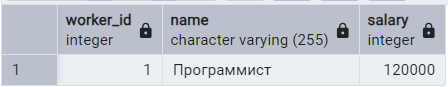

## 5.3 Покупатели, совершившие наибольшее количество покупок

```sql
SELECT b.buyer_id, b.login
FROM marketplace.buyers b
WHERE (
  SELECT COUNT(*) FROM marketplace.purchases p WHERE p.buyer_id = b.buyer_id
) >= ALL (
  SELECT COUNT(*) FROM marketplace.purchases p2 WHERE p2.buyer_id <> b.buyer_id GROUP BY p2.buyer_id
);
```
​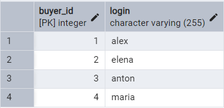

# 6. Подзапросы с IN

## 6.1 Товары, относящиеся к категориям с описанием

```sql
SELECT name
FROM marketplace.items
WHERE category_id IN (
  SELECT category_id FROM marketplace.category_of_item WHERE description IS NOT NULL
);
```
​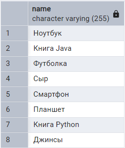

## 6.2 Магазины владельцев с логином на "ov"

```sql
SELECT name FROM marketplace.shops
WHERE owner_id IN (
  SELECT worker_id FROM marketplace.workers WHERE login LIKE '%ov'
);
```
​

## 6.3 Покупатели, совершившие покупки в магазинах с электричеством

```sql
SELECT b.buyer_id, b.login
FROM marketplace.buyers b
WHERE b.buyer_id IN (
  SELECT DISTINCT p.buyer_id
  FROM marketplace.purchases p
  JOIN marketplace.items i ON i.item_id = p.item_id
  WHERE i.shop_id IN (
    SELECT s.shop_id FROM marketplace.shops s WHERE s.name LIKE '%электр%'
  )
)
ORDER BY b.buyer_id;
```
​

# 7. Подзапросы с ANY

## 7.1 Товары, цена которых наивысшая среди категории

```sql
SELECT item_id, name
FROM marketplace.items i
WHERE price >= ANY (
  SELECT price FROM marketplace.items WHERE category_id = i.category_id
);
```
​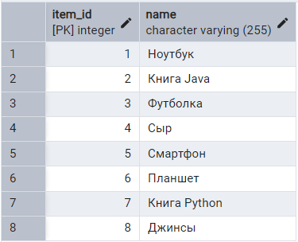

## 7.2 Работники, чья профессия имеет ту же зарплату, что и хоть одна другая

```sql
SELECT DISTINCT w.worker_id, p.salary
FROM marketplace.workers w
JOIN marketplace.worker_assignments wa ON w.worker_id = wa.worker_id
JOIN marketplace.profession p ON wa.work_id = p.profession_id
WHERE p.salary = ANY (
  SELECT salary FROM marketplace.profession WHERE profession_id <> p.profession_id
);
```
​

## 7.3 Заказы в пунктах выдачи, чьи номера совпадают с любым id заказа

```sql
SELECT * FROM marketplace.orders
WHERE pvz_id = ANY (
  SELECT order_id FROM marketplace.orders
);
```
​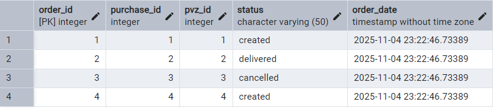

# 8. Подзапросы с EXISTS

## 8.1 Магазины, где есть хотя бы один товар

```sql
SELECT shop_id, name
FROM marketplace.shops s
WHERE EXISTS (
  SELECT 1 FROM marketplace.items i WHERE i.shop_id = s.shop_id
);
```
​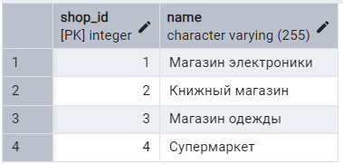

## 8.2 Категории, в которых есть товары с ценой выше 1000

```sql
SELECT category_id, name
FROM marketplace.category_of_item c
WHERE EXISTS (
  SELECT 1 FROM marketplace.items i WHERE i.category_id = c.category_id AND i.price > 1000
);
```
​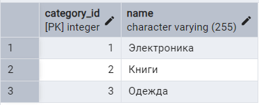

## 8.3 Покупатели, у которых есть покупки

```sql
SELECT buyer_id, login FROM marketplace.buyers b
WHERE EXISTS (
  SELECT 1 FROM marketplace.purchases p WHERE p.buyer_id = b.buyer_id
);
```
​

# 9. Сравнение по столбцам

## 9.1 Покупки, где purchase_id совпадает с buyer_id

```sql
SELECT p.*, b.login
FROM marketplace.purchases p
JOIN marketplace.buyers b ON p.buyer_id = b.buyer_id
WHERE (p.purchase_id, p.buyer_id) IN (
  SELECT purchase_id, buyer_id 
  FROM marketplace.purchases 
  WHERE purchase_id = buyer_id
);
```
​

## 9.2 Товары, где category_id меньше или равен shop_id

```sql
SELECT i.*, c.name AS category_name
FROM marketplace.items i
JOIN marketplace.category_of_item c ON i.category_id = c.category_id
WHERE (i.category_id, i.shop_id) IN (
  SELECT category_id, shop_id 
  FROM marketplace.items 
  WHERE category_id <= shop_id
);
```
​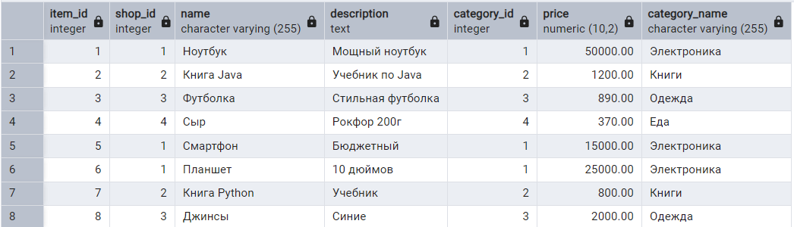

## 9.3 Заказы, где номер заказа совпадает с id пункта выдачи

```sql
SELECT o.*, pvz.address
FROM marketplace.orders o
JOIN marketplace.pvz ON o.pvz_id = pvz.pvz_id
WHERE (o.order_id, o.pvz_id) IN (
  SELECT order_id, pvz_id 
  FROM marketplace.orders 
  WHERE order_id = pvz_id
);
```
​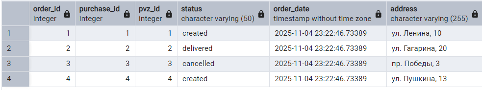

# 10 Коррелированные подзапросы

## 10.1 Покупатели, у которых есть покупки
```sql
SELECT b.login
FROM marketplace.buyers b
WHERE EXISTS (
    SELECT 1
    FROM marketplace.purchases p
    WHERE p.buyer_id = b.buyer_id
);
```
​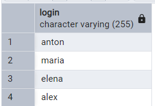

## 10.2 Товары дороже средней цены в их категории

```sql
SELECT i1.name, i1.price, c.name as category
FROM marketplace.items i1
JOIN marketplace.category_of_item c ON i1.category_id = c.category_id
WHERE i1.price > (
    SELECT AVG(i2.price)
    FROM marketplace.items i2
    WHERE i2.category_id = i1.category_id
);
```
​

## 10.3 Работники, у которых есть коллеги в том же типе места

```sql
SELECT w1.login, wa1.place_type
FROM marketplace.workers w1
JOIN marketplace.worker_assignments wa1 ON w1.worker_id = wa1.worker_id
WHERE EXISTS (
    SELECT 1
    FROM marketplace.worker_assignments wa2
    JOIN marketplace.workers w2 ON wa2.worker_id = w2.worker_id
    WHERE wa2.place_type = wa1.place_type
    AND w2.worker_id != w1.worker_id
);
```


## 10.4 Покупатели, которые оставляли отзывы
```sql
SELECT b.login, r.rating, r.description
FROM marketplace.buyers b
JOIN marketplace.purchases p ON b.buyer_id = p.buyer_id
JOIN marketplace.reviews r ON p.purchase_id = r.purchase_id
WHERE EXISTS (
    SELECT 1
    FROM marketplace.reviews r2
    JOIN marketplace.purchases p2 ON r2.purchase_id = p2.purchase_id
    WHERE p2.buyer_id = b.buyer_id
);
```
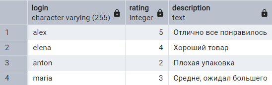

## 10.5 Найти профессии, у которых есть вариант роста с зарплатой выше средней по всем профессиям
```sql
SELECT p1.name, p1.salary
FROM marketplace.profession p1
WHERE EXISTS (
    SELECT 1
    FROM marketplace.career_path cp
    JOIN marketplace.profession p2 ON cp.next_profession_id = p2.profession_id
    WHERE cp.current_profession_id = p1.profession_id  -- КОРРЕЛЯЦИЯ!
    AND p2.salary > (SELECT AVG(salary) FROM marketplace.profession)
);
```
